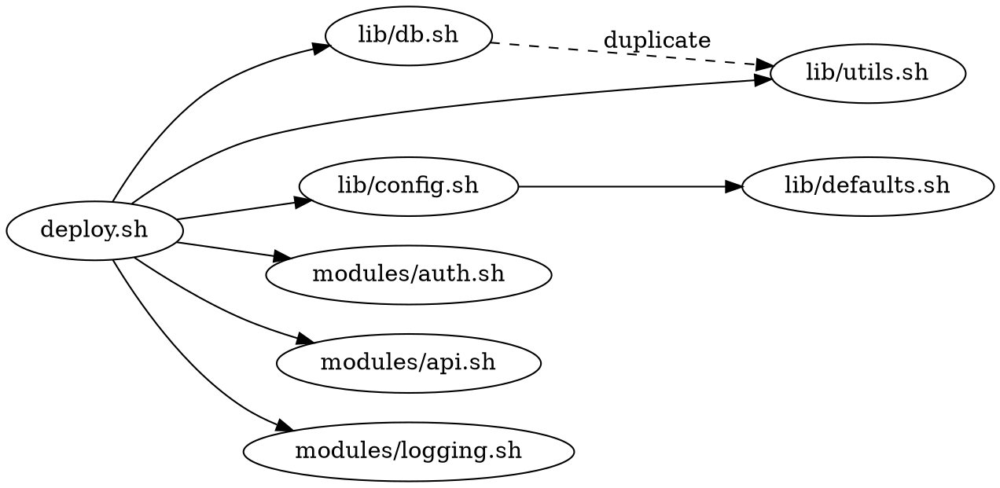

# AI.md — bashpack

## Project Overview

**bashpack** is a Rust CLI tool that flattens bash scripts by recursively inlining all `source`/`.` includes into a single self-contained script, with optional compilation to a native binary via `shc`. The tool itself compiles to a single static binary with zero runtime dependencies.

- **Language:** Rust (latest stable, edition 2026)
- **Build:** Cargo, targeting `x86_64-unknown-linux-musl` for fully static binary
- **License:** MIT
- **Repository org:** casapps
- **Target Platforms:** Linux (primary), macOS (secondary)
- **Runtime dependencies:** None for flattening. `shc` for compilation (auto-installed from GitHub releases if missing).

## Architecture

```
bashpack/
├── Cargo.toml
├── Cargo.lock
├── src/
│   ├── main.rs             # Entrypoint, CLI setup via clap
│   ├── cli.rs              # Clap argument definitions and validation
│   ├── flattener.rs        # Core recursive inlining engine
│   ├── parser.rs           # Source directive detection and classification
│   ├── resolver.rs         # File path resolution (relative, $DIR, globs)
│   ├── compiler.rs         # shc integration — invocation, flag passthrough
│   ├── shc_installer.rs    # Auto-download shc from GitHub releases, build & install
│   ├── depgraph.rs         # Dependency graph builder and tree/dot output
│   ├── validator.rs        # Circular dep detection, missing file checks, pre-flight
│   ├── errors.rs           # Unified error types using thiserror
│   ├── logger.rs           # Logging setup (env_logger / tracing integration)
│   └── utils.rs            # Path helpers, shebang handling, temp file management
├── tests/
│   ├── integration/
│   │   ├── flatten_simple.rs
│   │   ├── flatten_nested.rs
│   │   ├── flatten_conditional.rs
│   │   ├── flatten_glob.rs
│   │   ├── flatten_circular.rs
│   │   ├── flatten_duplicates.rs
│   │   ├── compile.rs
│   │   └── depgraph.rs
│   └── fixtures/
│       ├── simple/          # Basic source ./lib.sh patterns
│       ├── nested/          # Multi-level nested includes
│       ├── conditional/     # if/else source blocks
│       ├── dirpattern/      # BASH_SOURCE[0] / $DIR patterns
│       ├── glob/            # for f in ./modules/*.sh patterns
│       ├── circular/        # Circular dependency detection test
│       └── expected/        # Expected flattened output for snapshot testing
├── CLAUDE.md
├── README.md
├── LICENSE
└── .github/
    └── workflows/
        └── ci.yml           # Build, test, clippy, fmt checks
```

## Rust Standards and Best Practices

### Toolchain and Compilation

- **Edition:** 2024
- **MSRV:** Latest stable at time of development
- **Static binary:** Always build with `--target x86_64-unknown-linux-musl` for Linux. Install via `rustup target add x86_64-unknown-linux-musl`.
- **Release profile in Cargo.toml:**
  ```toml
  [profile.release]
  lto = true
  strip = true
  codegen-units = 1
  panic = "abort"
  ```

### Dependencies (Cargo.toml)

Use only well-maintained, minimal crates:

| Crate | Purpose |
|---|---|
| `clap` (derive) | CLI argument parsing with derive macros |
| `thiserror` | Ergonomic error type definitions |
| `anyhow` | Error propagation in main/integration points |
| `env_logger` + `log` | Logging (or `tracing` + `tracing-subscriber` if preferred) |
| `glob` | Filesystem glob pattern matching |
| `regex` | Source directive pattern matching |
| `tempfile` | Secure temporary file/directory creation |
| `reqwest` (blocking, rustls-tls) | HTTP client for shc download (use `rustls` not `openssl` for static builds) |
| `flate2` | Gzip decompression for shc tarball |
| `tar` | Tar archive extraction for shc |
| `serde` + `serde_json` | Parse GitHub API responses for shc releases |
| `colored` | Terminal color output for warnings/errors/verbose |

Do **not** add dependencies beyond what is necessary. Justify any new crate additions.

### Code Quality Rules

- **`cargo fmt`** — All code must be formatted with rustfmt. No exceptions.
- **`cargo clippy`** — Zero warnings. Use `#[allow(clippy::...)]` only with a `// Reason:` comment.
- **No `unwrap()` or `expect()` in library code** — All errors must propagate via `Result`. `unwrap()`/`expect()` are acceptable only in tests and in `main()` after final validation.
- **No `unsafe`** — There is no need for unsafe code in this project. Do not use it.
- **Documentation** — All public functions and structs must have `///` doc comments. Module-level `//!` docs for each file explaining its role.
- **Error messages** — All errors must be actionable. Include the file path, line number, and what went wrong. Example: `Error: unresolvable source directive at ./deploy.sh:47: source "$PLUGIN_DIR/${name}.sh" (variable path cannot be statically resolved)`.
- **Tests** — Every module must have unit tests (`#[cfg(test)] mod tests`). Integration tests in `tests/integration/` cover end-to-end behavior against fixtures.

### Code Organization Patterns

- Use the **builder pattern** for any struct with more than 3 optional fields.
- Use **enums** for source directive classification (Simple, DirPattern, Conditional, Glob, Dynamic).
- Functions should be small and single-purpose. If a function exceeds ~50 lines, consider splitting it.
- Use `impl` blocks to organize methods logically. Separate public API from private helpers.
- All file I/O must use `BufReader`/`BufWriter` for performance.
- Paths must be handled with `std::path::PathBuf`/`Path`, never raw strings.

## CLI Interface

Built with `clap` derive macros. Follow GNU/POSIX CLI conventions.

```
bashpack - Flatten bash scripts into a single file, optionally compile to binary

Usage: bashpack [OPTIONS] <ENTRY_SCRIPT>

Arguments:
  <ENTRY_SCRIPT>              Path to the root bash script

Options:
  -o, --output <FILE>         Output file path
                              (default: stdout for flatten, <name>.bin for compile)
  -c, --compile               Compile flattened script to binary via shc
  -s, --strict                Fail on any unresolvable source directives
      --no-markers            Omit source traceability comments in output
      --allow-duplicate-includes
                              Inline files multiple times if sourced multiple times
      --dry-run               Show what would be inlined without producing output
      --depgraph [FORMAT]     Print dependency graph and exit [tree, dot] (default: tree)
      --shc-flags <FLAGS>     Additional flags passed through to shc (implies --compile)
      --shc-path <PATH>       Path to shc binary (skip auto-detection/install)
      --install-shc           Install shc from GitHub releases and exit
  -v, --verbose               Enable verbose output (repeat for more: -vv, -vvv)
  -q, --quiet                 Suppress all warnings
      --debug                 Enable debug output (sets RUST_LOG=debug, very noisy)
      --no-color              Disable colored output
  -h, --help                  Print help information
  -V, --version               Print version information

Examples:
  bashpack ./deploy.sh                           # Flatten to stdout
  bashpack -o packed.sh ./deploy.sh              # Flatten to file
  bashpack -c -o deploy ./deploy.sh              # Flatten + compile to binary
  bashpack --depgraph ./deploy.sh                # Show include tree
  bashpack --depgraph dot ./deploy.sh | dot -Tpng -o deps.png
  bashpack --strict -vv ./deploy.sh              # Strict mode, very verbose
  bashpack --install-shc                         # Just install shc
```

### Flag Behavior Details

| Flag | Behavior |
|---|---|
| `-h, --help` | Standard clap-generated help. Includes all flags, args, descriptions, and examples. |
| `-V, --version` | Prints `bashpack <version>` from Cargo.toml. Use `clap`'s built-in version propagation. |
| `--debug` | Sets `RUST_LOG=bashpack=trace` programmatically before logger init. Overrides `-v` flags. Prints internal state: parsed directives, resolution paths, file hashes, timing info. |
| `-v` | Stackable verbosity. `-v` = INFO, `-vv` = DEBUG, `-vvv` = TRACE. Implemented via `clap`'s `action = ArgAction::Count`. |
| `-q, --quiet` | Sets log level to ERROR. Mutually exclusive with `-v` and `--debug` (enforce via clap conflict rules). |
| `--no-color` | Disables colored output. Also auto-detected via `NO_COLOR` env var (see https://no-color.org/) and when stdout is not a TTY. |
| `--dry-run` | Performs all parsing and resolution but writes nothing. Prints a summary of what would be inlined to stderr. |
| `--strict` | Promotes all warnings to errors. Specifically: unresolvable dynamic directives, missing optional files, and glob patterns matching zero files all become fatal. |

### Verbosity Levels

| Flag | Log Level | What it shows |
|---|---|---|
| (default) | WARN | Warnings and errors only |
| `-v` | INFO | File resolution steps, include count summary |
| `-vv` | DEBUG | Each directive found, path resolution logic, timing |
| `-vvv` / `--debug` | TRACE | Full parse detail, regex matches, shc invocation args |
| `-q` | ERROR | Errors only, suppress all warnings |

## Core Behavior Specification

### Source Directive Detection (parser.rs)

Detect and classify source directives by scanning each line. Classify into these variants:

```rust
enum SourceDirective {
    /// source ./lib.sh or . ./lib.sh — path is a literal string
    Simple { path: String, line_no: usize },
    /// source "$DIR/lib.sh" where DIR follows the BASH_SOURCE pattern
    DirPattern { relative_path: String, line_no: usize },
    /// source inside if/else/case block
    Conditional { branches: Vec<ConditionalBranch>, line_no: usize },
    /// for f in ./modules/*.sh; do source "$f"; done
    Glob { pattern: String, line_no: usize },
    /// source "$SOME_VAR/plugin.sh" — cannot resolve statically
    Dynamic { raw_line: String, line_no: usize },
}
```

**Detection rules:**
- Match lines where the first command word is `source` or `.` (as a builtin, not path component).
- Handle quoting: `source "./lib.sh"`, `source './lib.sh'`, `source ./lib.sh`.
- Ignore commented lines (`# source ./foo.sh`).
- Ignore `source` inside heredocs and strings.
- Detect the `DIR="$(cd "$(dirname "${BASH_SOURCE[0]}")" && pwd)"` idiom and track the variable name assigned, to resolve later `$DIR` references.

### Flattening Rules (flattener.rs)

1. **Simple directives** — Replace the `source` line with the file contents. Wrap in marker comments unless `--no-markers`.

2. **DirPattern directives** — Resolve the path relative to the file containing the directive (this is what the `$DIR` pattern does at runtime). Inline as with Simple.

3. **Conditional directives** — Inline ALL branches. Preserve the original conditional structure wrapping the inlined content:
   ```bash
   if [[ "$MODE" == "debug" ]]; then
       # --- [bashpack] Begin: debug.sh ---
       <contents of debug.sh>
       # --- [bashpack] End: debug.sh ---
   else
       # --- [bashpack] Begin: production.sh ---
       <contents of production.sh>
       # --- [bashpack] End: production.sh ---
   fi
   ```

4. **Glob directives** — Resolve the glob at build time. Inline all matching files. Replace the loop body with sequential inlined content:
   ```bash
   # --- [bashpack] Glob expanded: ./modules/*.sh (3 files) ---
   # --- [bashpack] Begin: modules/auth.sh ---
   <contents>
   # --- [bashpack] End: modules/auth.sh ---
   # --- [bashpack] Begin: modules/db.sh ---
   <contents>
   # --- [bashpack] End: modules/db.sh ---
   # --- [bashpack] Begin: modules/logging.sh ---
   <contents>
   # --- [bashpack] End: modules/logging.sh ---
   ```

5. **Dynamic directives** — Emit a warning to stderr with file and line number. Leave the directive in place unchanged. In `--strict` mode, this is a fatal error.

6. **Circular dependency detection** — Maintain a `HashSet<PathBuf>` stack of files currently being inlined. If a file appears in its own chain, emit an error with the full cycle path and abort.

7. **Include-once (default)** — Track all inlined files in a `HashSet<PathBuf>`. On duplicate, replace the directive with a comment: `# [bashpack] Already included: lib/utils.sh`. Override with `--allow-duplicate-includes`.

8. **Shebang handling** — Preserve only the root script's shebang. Strip `#!/...` lines from all inlined files.

9. **Traceability markers** — Unless `--no-markers`, wrap each inlined block:
   ```bash
   # --- [bashpack] Begin: <relative-path> ---
   <contents>
   # --- [bashpack] End: <relative-path> ---
   ```

### shc Auto-Installation (shc_installer.rs)

When `--compile` is used and `shc` is not found in `$PATH` (or at `--shc-path`):

1. **Check for existing shc** — Search in order: `--shc-path` flag, `~/.local/bin/shc`, then `$PATH` via `which shc`. If found, verify with `shc -v` and use it.

2. **Check for C compiler** — Before downloading anything, verify `gcc` or `cc` exists in `$PATH`. If not, emit a clear error: `Error: C compiler (gcc/cc) not found. Install build-essential (Debian/Ubuntu) or gcc (RHEL/AlmaLinux) to build shc, or provide a pre-built shc via --shc-path.`

3. **Fetch latest release tag** — Query `https://api.github.com/repos/neurobin/shc/releases/latest`. Parse the JSON response to extract the tag name and tarball URL. Set a `User-Agent: bashpack/<version>` header (GitHub API requires it). Handle rate limits gracefully — if 403, tell the user to try again or download manually.

4. **Download tarball** — Download the `.tar.gz` source archive to a `tempfile::TempDir` via `reqwest` blocking client with `rustls-tls`. Show a progress indicator if `-v` is set: `Downloading shc vX.X.X...`

5. **Extract** — Decompress with `flate2::read::GzDecoder` and extract with `tar::Archive`. Locate the extracted directory (typically `shc-X.X.X/`).

6. **Build** — Execute `./configure && make` in the extracted directory using `std::process::Command`. Capture stdout/stderr. On failure, print the build output and a helpful error message.

7. **Install** — Copy the built `shc` binary to `~/.local/bin/shc`. Create `~/.local/bin/` if it doesn't exist. Set executable permissions (`chmod 755`). Print: `Installed shc vX.X.X to ~/.local/bin/shc`.

8. **PATH hint** — If `~/.local/bin` is not in `$PATH`, warn: `Note: ~/.local/bin is not in your PATH. bashpack will find it automatically, but you may want to add it: export PATH="$HOME/.local/bin:$PATH"`.

9. **Standalone install** — If `--install-shc` is passed with no entry script, perform steps 1-8 and exit with code 0 on success.

### Compilation (compiler.rs)

When `--compile` is used:

1. Flatten the script to a `tempfile::NamedTempFile`.
2. Locate or install `shc` (via shc_installer).
3. Invoke: `shc -f <tempfile> -o <output> [extra --shc-flags]`.
4. Check exit code. On failure, show shc's stderr output verbatim.
5. Clean up temp files (handled automatically by `tempfile` Drop).
6. Set output binary permissions to `755`.
7. Print: `Compiled: <output> (<size> bytes)`.

### Dependency Graph (depgraph.rs)

When `--depgraph` is used:

**Tree format (default):**
```
deploy.sh
├── lib/utils.sh
├── lib/config.sh
│   └── lib/defaults.sh
├── lib/db.sh
│   └── lib/utils.sh (already included)
└── modules/*.sh
    ├── modules/auth.sh
    ├── modules/api.sh
    └── modules/logging.sh
```

**Dot format:** Output valid Graphviz DOT for piping to `dot`:


## Error Handling Strategy

Define a unified error enum in `errors.rs`:

```rust
#[derive(thiserror::Error, Debug)]
pub enum BashpackError {
    #[error("file not found: {path} (referenced at {source_file}:{line_no})")]
    FileNotFound { path: PathBuf, source_file: PathBuf, line_no: usize },

    #[error("circular dependency detected: {chain}")]
    CircularDependency { chain: String },

    #[error("unresolvable source directive at {file}:{line_no}: {raw_line}")]
    UnresolvableDirective { file: PathBuf, line_no: usize, raw_line: String },

    #[error("glob pattern matched zero files: {pattern} (at {file}:{line_no})")]
    EmptyGlob { pattern: String, file: PathBuf, line_no: usize },

    #[error("shc compilation failed (exit code {code}): {stderr}")]
    ShcFailed { code: i32, stderr: String },

    #[error("shc not found and auto-install failed: {reason}")]
    ShcInstallFailed { reason: String },

    #[error("C compiler not found — required to build shc. Install gcc or build-essential.")]
    NoCCompiler,

    #[error("GitHub API error while fetching shc release: {reason}")]
    GitHubApiFailed { reason: String },

    #[error("entry script not found: {0}")]
    EntryNotFound(PathBuf),

    #[error("entry script is not a file: {0}")]
    EntryNotAFile(PathBuf),

    #[error(transparent)]
    Io(#[from] std::io::Error),

    #[error(transparent)]
    Http(#[from] reqwest::Error),

    #[error("glob pattern error: {0}")]
    GlobPattern(#[from] glob::PatternError),
}
```

Every error must be contextual and actionable. Never print just "error occurred."

### Exit Codes

| Code | Meaning |
|---|---|
| 0 | Success |
| 1 | General error (parse failure, file not found, etc.) |
| 2 | CLI usage error (invalid flags, missing arguments) |
| 3 | Circular dependency detected |
| 4 | shc compilation failed |
| 5 | shc installation failed |

Implement via a `process::exit()` mapping in `main.rs` based on the error variant.

## Testing Strategy

### Unit Tests
- `parser.rs` — Test each directive classification against sample lines. Edge cases: commented lines, heredocs, mixed quoting, `source` as a substring in paths, `.` as current directory vs `.` as source builtin.
- `resolver.rs` — Test path resolution for relative, absolute, `$DIR`, and glob patterns.
- `flattener.rs` — Test inlining with mocked file contents. Verify marker placement, shebang stripping, duplicate detection, circular detection.
- `depgraph.rs` — Test tree and dot output format.
- `validator.rs` — Test pre-flight checks.
- `shc_installer.rs` — Test GitHub API response parsing (mock the HTTP call).

### Integration Tests
- Use the `fixtures/` directory with real bash scripts.
- Each test flattens a fixture and compares output to `expected/` snapshots.
- One test verifies `--compile` produces a runnable binary (requires `shc` in CI or skip with `#[ignore]`).
- Test `--depgraph` output in both tree and dot formats.
- Test `--strict` mode escalates warnings to errors.
- Test `--dry-run` produces no output files.

### Running Tests
```bash
cargo test                    # All unit + integration tests
cargo test -- --ignored       # Include tests that require shc
```

## Build and Install

```bash
# Development build
cargo build

# Release — static musl binary
rustup target add x86_64-unknown-linux-musl
cargo build --release --target x86_64-unknown-linux-musl

# Binary at: target/x86_64-unknown-linux-musl/release/bashpack

# Install locally
cp target/x86_64-unknown-linux-musl/release/bashpack ~/.local/bin/
```

## CI Pipeline (.github/workflows/ci.yml)

```yaml
jobs:
  check:
    runs-on: ubuntu-latest
    steps:
      - uses: actions/checkout@v4
      - uses: dtolnay/rust-toolchain@stable
        with:
          targets: x86_64-unknown-linux-musl
          components: rustfmt, clippy
      - run: cargo fmt --check
      - run: cargo clippy -- -D warnings
      - run: cargo test
      - run: cargo build --release --target x86_64-unknown-linux-musl
      - uses: actions/upload-artifact@v4
        with:
          name: bashpack-linux-amd64
          path: target/x86_64-unknown-linux-musl/release/bashpack
```

## Commit Convention

Use conventional commits: `feat:`, `fix:`, `refactor:`, `test:`, `docs:`, `chore:`.

## Development Workflow Reminders

- Run `cargo fmt` before every commit.
- Run `cargo clippy` and fix all warnings before every commit.
- Add or update tests for every behavioral change.
- Keep `Cargo.lock` in version control (this is a binary, not a library).
- Update version in `Cargo.toml` on every release.
- Test the static musl build before tagging a release.
